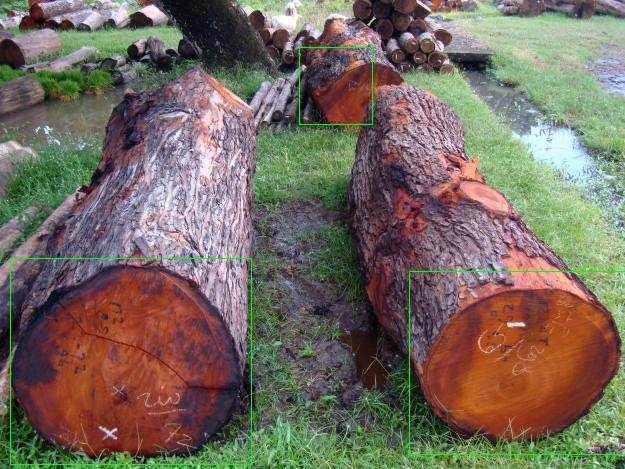

# Haar Cascade for Object Detection 

This work employs a Haar Cascade detector to identify wood logs. Positioned on the harvesting machine at the harvesting station, the camera captures images of wood log cross-sections triggered by their movement on the cutting belt. However, external factors occasionally cause false triggers, capturing images without wood logs. The Haar Cascade model effectively distinguishes the presence of wood logs in the images, eliminating those without wood logs from consideration.

In this project, we implement a Haar Cascade using OpenCV. This is a machine-learning object detection method used to identify objects in images or video. It is based on the Haar Wavelet technique, which is a mathematical concept used in signal processing. The Haar Cascade is particularly popular for detecting faces in images.


# Overview

1. To use a Haar Cascade Classifier for a specific object detection task, the classifier needs to be trained. During training, the classifier is provided with positive and negative samples of the object. Positive samples contain the object of interest, while negative samples do not.
2. The Haar Cascade method works by evaluating rectangular features at different scales in an image. These features are like filters that respond to specific patterns of intensity changes in the image.
3. To efficiently compute these features, the integral image concept is used. The integral image allows for the rapid calculation of the sum of pixel values in a rectangular region.
4. Adaboost Training: During training, a machine learning algorithm called Adaboost is used to select the most relevant features and assign weights to them. Weaker classifiers are combined into a strong classifier that can effectively discriminate between positive and negative samples.
5. During the detection phase, a sliding window is used to scan the image at different scales and positions. At each step, the classifier evaluates the features within the window to determine if the object is present.

# Getting started

* Install OpenCV for annotation and training in Windows. Download the .exe file of the latest version of OpenCV here: https://sourceforge.net/projects/opencvlibrary/files/opencv-win/3.4.3/
* After downloading, extract the folder called 'opencv' and copy this path: C:\Users\username\Downloads\opencv\build\x64\vc15\bin
* In the above extracted folder, we are going to use opencv_annotation.exe, opencv_createsamples.exe, opencv_traincascade.exe and opencv_visualisation.exe. Please refer to the [command.txt](command.txt) file for using the opencv commands.
* Put the positive images containing the object in the [positive](positive) folder and the negative images without the objects in the [negative](negative) folder respectively.
* [cascadeutils.py](cascadeutils.py): This script is used to create a list of negative files and store it in the [neg.txt](neg.txt) and the [pos.txt](pos.txt) file is generated from the OpenCV command opencv_annotation.exe:
  ```bash
  $ C:\opencv\build\x64\vc15\bin\opencv_annotation.exe --annotations=pos.txt --images=positive -m=1 -r=3 
  ```
* Next we need to create samples for the positive images with the following command:
  ```bash
  $ C:\opencv\build\x64\vc15\bin\opencv_createsamples.exe -info pos.txt -h 48 -w 48 -num 1000 -vec pos.vec 
  ```
  It creates samples and stores them in the pos.vec file which is a binary image file with width '-w' and height '-h' of the 
  detection window size, and the number of vectors for '-num'.

* Next, train the classifier as shown below:
  ```bash
  $ C:\opencv\build\x64\vc15\bin\opencv_traincascade.exe -data cascade/ -vec pos.vec -bg neg.txt -w 48 -h 48 -numPos 8
    0 -numNeg 200 -numStages 10 
  ```

* Finally, the model is tested with [main.py](main.py).

# Demo Result

## Dataset Notice

Please note that the dataset used in this project is proprietary and owned by a company client of Fraunhofer IPM. Unfortunately, we are unable to provide public access to the dataset due to legal and confidentiality agreements. The focus of this repository is to showcase the code, methodology, and results derived from the dataset.

This is a test output after training the model with the company dataset from the forest and the test image is obtained from Google.



# References

Published Paper: https://www.cs.cmu.edu/~efros/courses/LBMV07/Papers/viola-cvpr-01.pdf

Link to the OpenCV tutorial: https://www.cs.cmu.edu/~efros/courses/LBMV07/Papers/viola-cvpr-01.pdf

